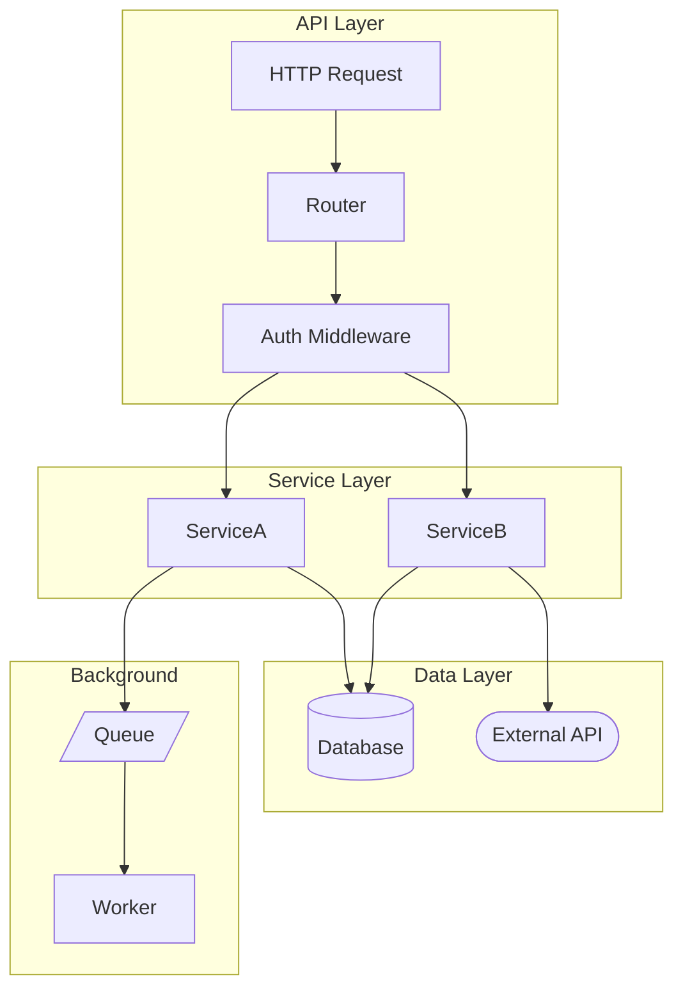
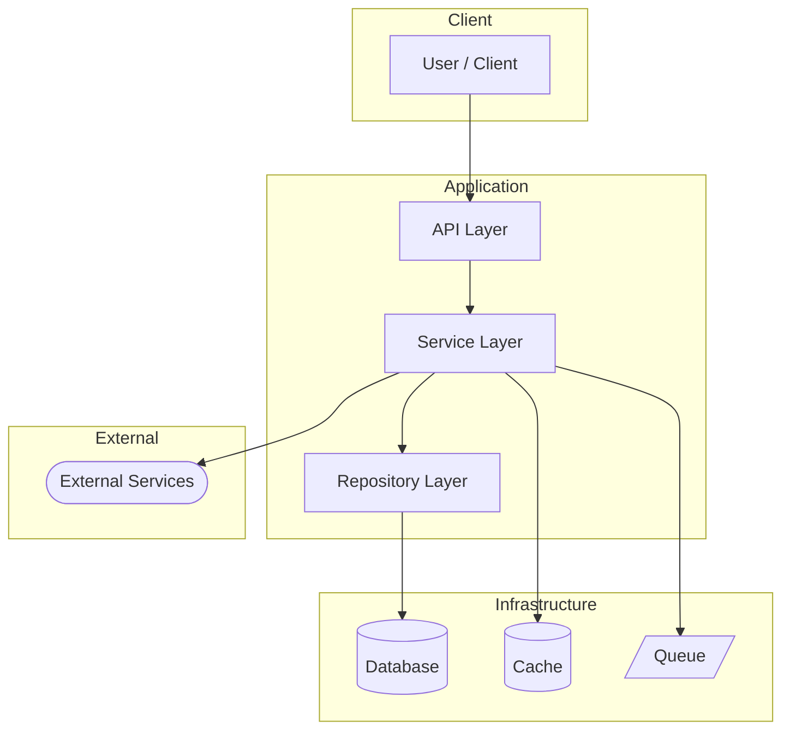

# Codebase exploration agent
# Reads everything, writes SCRATCHPAD.md to repo root + docs/

## Step 1 — Discover the codebase structure

Use Glob to find all Python files:
- Entry points: main.py, app.py, server.py, cli.py, manage.py, run.py
- All directories and their purpose
- Config files: pyproject.toml, setup.py, requirements.txt, .env.example
- Test structure: tests/ layout

Use Read to read:
- CLAUDE.md (project standards)
- pyproject.toml or requirements.txt (dependencies)
- Entry point files
- Key service files in src/ or app/

Use Grep to find:
- All route definitions (@app.route, @router.get, APIRouter)
- All class definitions
- All import patterns
- Database model definitions
- External API calls (httpx, requests)
- Celery tasks or background jobs
- Event emitters or message queue calls

## Step 2 — Map the architecture

Understand:
- What does this system DO (in one sentence)?
- What are the main layers? (API, services, repositories, models, workers)
- What external services does it call?
- What does it expose to the outside world?
- How does data flow through the system?
- What are the async/background processing paths?

## Step 3 — Map all workflows

A workflow is a complete user or system action from trigger to completion.
For each workflow identify:
- Trigger (HTTP request, cron job, message queue, event)
- Steps in order (which functions/services are called)
- External calls made
- Database operations
- Output or side effects

## Step 4 — Write SCRATCHPAD.md

Write the complete file. Content must include:

# SCRATCHPAD.md — Codebase Intelligence Map
> Generated by engi — {date}
> Read this at the start of every new session instead of re-exploring

## What this system does
{One clear sentence}

## Tech stack
- Language: Python {version}
- Framework: {FastAPI / Django / Flask}
- Database: {PostgreSQL / SQLite / etc}
- Key dependencies: {top 5-8 with purpose}
- Background jobs: {Celery / RQ / none}
- External APIs: {all external services}

## Architecture layers
{Each layer and its responsibility}

## Entry points
| Entry point | File | Purpose |
|-------------|------|---------|

## Key patterns in use
- Data modelling, Error handling, Auth, DB access, Config

## Module map
{Each major directory: one-line description}

## Workflow graph

## System architecture diagram

## Where to start for common tasks
- New API endpoint: {file and pattern}
- New service: {file and pattern}
- New database model: {file and pattern}
- New background job: {file and pattern}
- New tests: {file and naming pattern}

## Gotchas and non-obvious things
{Things a new developer would NOT guess from the code}

## Open questions
{Things the exploration couldn't determine}

## Step 5 — Save outputs

After writing the content:

1. Save to repo root:
   Write("SCRATCHPAD.md", content)

2. Create docs folder and save a timestamped copy:
   Bash("mkdir -p docs/architecture")
   Write("docs/architecture/SCRATCHPAD.md", content)
   Write("docs/architecture/SCRATCHPAD_{YYYY-MM-DD}.md", content)

3. Create a docs/README.md index if it doesn't exist:
   Write("docs/README.md", """
# Project Documentation

Auto-generated by engi.

## Architecture
- [SCRATCHPAD.md](architecture/SCRATCHPAD.md) — Codebase map, workflow graph, architecture diagram

## Technical plans
{Listed automatically as TECH_DOC files are generated}
""")

## Step 6 — Confirm

Tell the user:
- Files written: SCRATCHPAD.md (repo root) + docs/architecture/SCRATCHPAD.md
- How many workflows were mapped
- How many modules discovered
- One-sentence system description
- "Open docs/ folder to find all agent outputs organised by type"
- "Read SCRATCHPAD.md at the start of every new Claude Code session"
